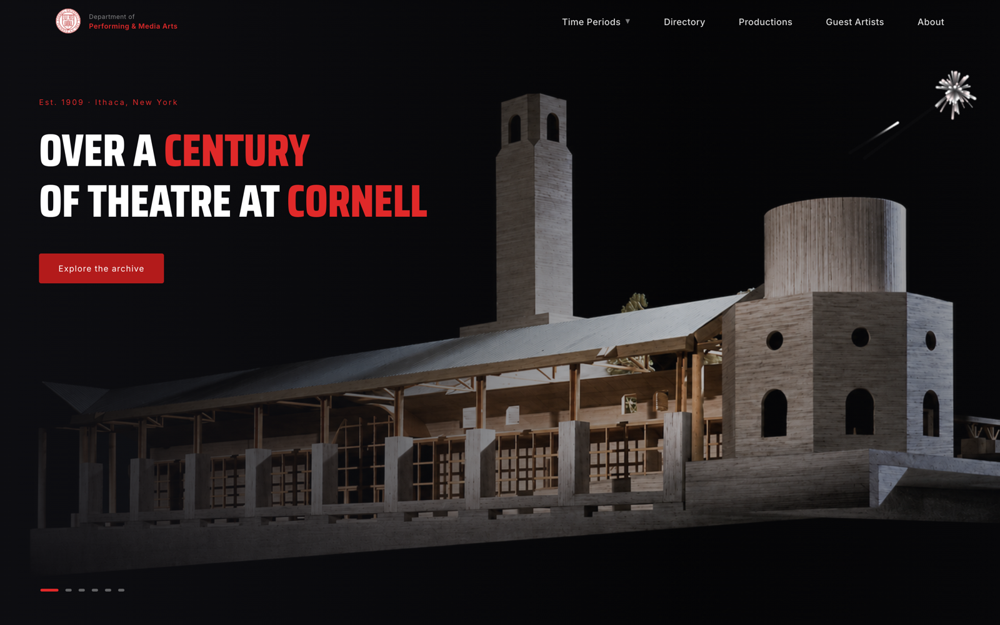
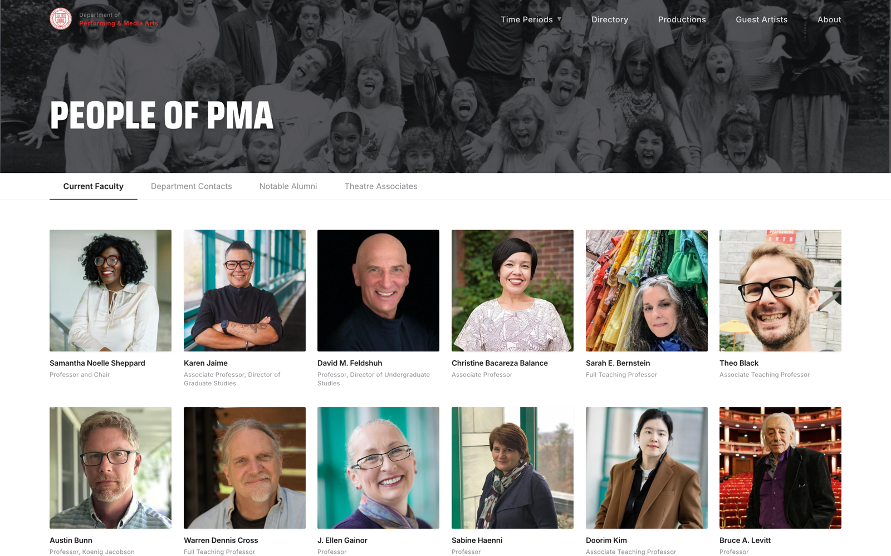
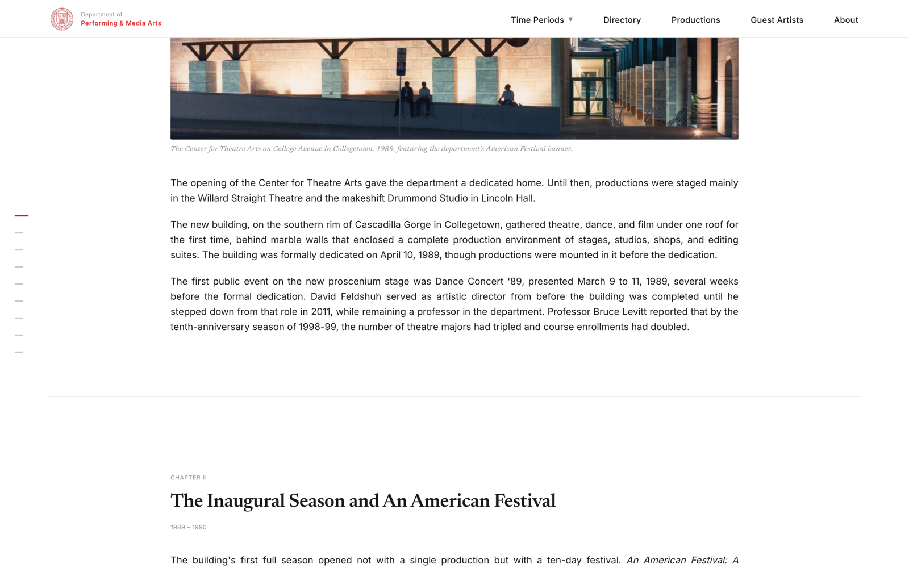

# A History of Theater at Cornell

An interactive web application chronicling 145 years of theater at Cornell University, from the 1880s student dramatic clubs through the opening of the Schwartz Center to the department's present-day Performing & Media Arts program. Built independently as a Cornell Nexus Scholars project, it was **adopted as the PMA Department's first-ever official independent website**, presented to the Dean of Cornell's College of Arts and Sciences in support of expanding funding for the performing and media arts, and is set to be featured in the *Cornell Daily Sun*. The underlying archival materials are being sent to the **Cornell Rare and Manuscript Collections** for an exhibition.

**Live site:** [pma-website-r8uj-ruby.vercel.app](https://pma-website-r8uj-ruby.vercel.app/)

## Screenshots

| Home | Directory |
|------|-----------|
|  |  |



_The Schwartz-era narrative, one of three long-form documentary sections._

---

## Impact

- **Adopted as the department's first-ever website.** The site was presented to the Cornell Department of Performing & Media Arts and approved as its official independent web presence; the department had never had one before.
- **Used to make the case for funding.** I presented to the Dean of Cornell's College of Arts and Sciences as part of an argument to expand funding for the performing and media arts, demonstrating the department's history and reach as evidence for continued investment.
- **Featured by the Cornell Daily Sun.** The project is set to be featured in the *Cornell Daily Sun* as an exhibition and as part of the case for expanded funding for the performing and media arts.
- **Archived for exhibition at Cornell.** The underlying materials are being sent to the **Cornell Rare and Manuscript Collections** for an exhibition, entering the university's permanent archival record.
- **A permanent, growing record.** The site preserves 145 years of archival material in a structured, browsable form that the department can continue to build on.

## Overview

The site turns thousands of digitized archival items (playbills, production photographs, program scans, alumni and faculty records) into a structured, navigable history organized into three eras:

- **I · Before the Center (1880–1988):** the origins of Cornell theater culture
- **II · The Schwartz Center:** the department's first permanent home
- **III · Emergence:** the modern Performing & Media Arts department

Alongside the era narratives, the site includes a searchable **directory** of 180+ alumni, faculty, and guest artists, a **repertory** catalog of 350+ productions, and dedicated pages for notable guests and productions.

## Highlights

- **~7,000 lines of TypeScript/React across 35+ components**, authored solo
- **8 distinct interactive views** with custom client-side view routing
- **1,000+ digitized images** and **350+ catalogued productions** structured into typed data
- **Custom responsive scaling engine:** the desktop layout is designed at a fixed 1440px canvas and scaled to the viewport via CSS `zoom`, so the composition holds its proportions across screen sizes while mobile reflows to real pixels
- **Scroll-reveal animation system** built on `IntersectionObserver`, with full `prefers-reduced-motion` support
- **Canvas particle system** (hand-written `<canvas>` fireworks) used as a celebratory accent
- **Cinematic intro sequence** gated by `sessionStorage` and web-font readiness so it never displays unstyled text

## Tech Stack

| Layer | Choice |
|-------|--------|
| Framework | React 18 |
| Language | TypeScript |
| Build tool | Vite |
| Styling | CSS (custom properties / design tokens in `globals.css`) |
| Fonts | Inter, Saira Condensed, Newsreader, Staatliches (Google Fonts) |
| Animation | `IntersectionObserver`, Canvas 2D, CSS transitions |

## Architecture

```
src/
├── App.tsx                 # top-level view router (state-driven page switching)
├── main.tsx                # entry point + page-scale install
├── components/
│   ├── layout/             # Nav, Footer, SectionsNav
│   ├── sections/           # Hero, Intro, EraSection
│   └── ui/                 # Reveal, Fireworks, Slider, ChapterRail
├── pages/                  # PreSchwartz, Schwartz, Emergence, Directory,
│                           #   Repertory, Guests, About
├── data/                   # eras.ts, nav.ts - typed content
├── lib/                    # scale.ts (responsive engine), useIsMobile, formatWorks
├── styles/globals.css      # design tokens + base styles
└── assets/                 # inline imagery
public/                     # scans, playbills, alumni/faculty/guest imagery (1,000+)
```

**Routing.** Navigation is a lightweight state machine in `App.tsx` rather than a URL router; each top-level view is a `Page` value, keeping the bundle lean and transitions fully controlled.

**Responsive scaling.** `lib/scale.ts` computes a zoom factor (`viewport width ÷ 1440`) and applies it to `document.body`, exposing it as a `--pz` CSS variable so scroll math stays accurate. Below the mobile breakpoint the site opts out of scaling and reflows normally.

**Motion.** `components/ui/Reveal.tsx` fades and translates content into view on intersection, disconnecting the observer after first reveal and short-circuiting entirely when the user prefers reduced motion.

## Running Locally

```bash
npm install
npm run dev      # start the Vite dev server
npm run build    # type-check (tsc) + production build
npm run preview  # preview the production build
```

Requires Node 18+.

## Credits

Designed and built by **Brian Hu** as a Cornell Nexus Scholars project, in collaboration with the Department of Performing & Media Arts. Archival materials courtesy of Cornell University; imagery is used for historical and educational purposes.

## License

© 2026 Brian Hu. All rights reserved. Archival materials remain the property of Cornell University and are used for historical and educational purposes only.
